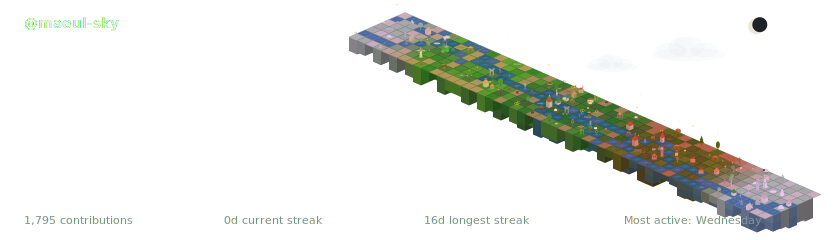
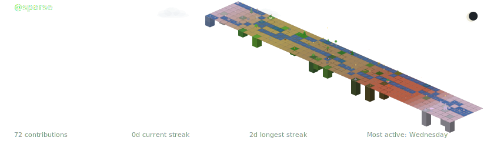
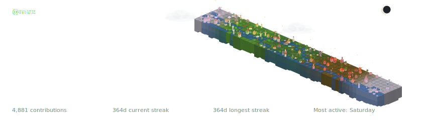

<div align="center">

# Maeul in the Sky

**Transform your GitHub contributions into an animated isometric terrain**

[](https://opensource.org/licenses/MIT)
[](https://nodejs.org/)
[](https://github.com/features/actions)
[](./docs/README.ko.md)
[](./docs/README.ja.md)
[](./docs/README.zh.md)

<br/>

<picture>
  <source media="(prefers-color-scheme: dark)" srcset=".github/assets/preview-dark.svg">
  <source media="(prefers-color-scheme: light)" srcset=".github/assets/preview-light.svg">
  
</picture>

*Your contribution graph as a living village — with seasonal weather, flowing rivers, and animated clouds.*

</div>

## What is Maeul in the Sky?

Maeul in the Sky (천공의 마을) turns your GitHub contribution history into an animated isometric terrain SVG. *Maeul* (마을) is Korean for "village" — your contribution graph becomes a living village floating in the sky. Each day's contribution level becomes a terrain block — from deep water (no activity) to towering city buildings (peak activity). The terrain transitions through four seasons with 48 unique seasonal assets, biome generation (rivers, ponds, forests), and ambient animations.

### Highlights

- **Isometric 3D terrain** — 100-level elevation system mapped to your contribution data
- **4-season cycle** — Winter, Spring, Summer, Autumn with smooth transitions and 48 seasonal assets
- **Biome generation** — Procedural rivers, ponds, and forest clusters via seeded noise
- **118 terrain asset types** — Trees, buildings, windmills, snowmen, cherry blossoms, and more
- **Animated SVG** — Clouds drift, water shimmers, flags wave — pure SVG, no JavaScript
- **Dark & Light mode** — Generates both variants; auto-switches via `<picture>` tag
- **Hemisphere support** — Northern or Southern hemisphere seasonal mapping
- **GitHub Action** — Drop into any workflow for automated daily updates

### More Previews

| Sparse (Archipelago) | Maximum Density (Civilization) |
|:---:|:---:|
|  |  |

## Quick Start

### GitHub Action (recommended)

Add this workflow to `.github/workflows/maeul-sky.yml`:

```yaml
name: Generate Maeul in the Sky Terrain
on:
  schedule:
    - cron: '0 0 * * *'  # daily
  workflow_dispatch:

permissions:
  contents: write

jobs:
  generate:
    runs-on: ubuntu-latest
    steps:
      - uses: actions/checkout@v4

      - uses: t1seo/maeul-in-the-sky@v1
        with:
          github_token: ${{ secrets.GITHUB_TOKEN }}

      - uses: stefanzweifel/git-auto-commit-action@v5
        with:
          commit_message: 'chore: update maeul-in-the-sky terrain'
```

Then add this to your profile README:

```markdown
<picture>
  <source media="(prefers-color-scheme: dark)" srcset="./maeul-in-the-sky-dark.svg">
  <source media="(prefers-color-scheme: light)" srcset="./maeul-in-the-sky-light.svg">
  
</picture>
```

### Action Inputs

| Input | Description | Default |
|-------|-------------|---------|
| `github_token` | GitHub token for API access | `${{ github.token }}` |
| `theme` | Theme name | `terrain` |
| `title` | Custom title text | GitHub username |
| `output_dir` | Output directory | `./` |
| `year` | Target year | Current year |
| `hemisphere` | Seasonal mapping (`north` or `south`) | `north` |
| `density` | Building density 1-10 (higher = buildings at lower activity) | `5` |

### Customization Examples

```yaml
# Southern hemisphere (Australia, Brazil, etc.)
- uses: t1seo/maeul-in-the-sky@v1
  with:
    github_token: ${{ secrets.GITHUB_TOKEN }}
    hemisphere: south

# Custom title
- uses: t1seo/maeul-in-the-sky@v1
  with:
    github_token: ${{ secrets.GITHUB_TOKEN }}
    title: "My Coding Journey"

# Specific year
- uses: t1seo/maeul-in-the-sky@v1
  with:
    github_token: ${{ secrets.GITHUB_TOKEN }}
    year: 2025

# More buildings even with moderate activity
- uses: t1seo/maeul-in-the-sky@v1
  with:
    github_token: ${{ secrets.GITHUB_TOKEN }}
    density: 8
```

## How Does the Terrain Work?

Each square on your GitHub contribution graph becomes a terrain block. The more you contribute on a given day, the more developed that block becomes.

| Your activity | Terrain | What you'll see |
|:---:|:---:|:---|
| No commits | 🌊 Water | Ocean tiles — the empty sea |
| A few commits | 🏖️ Sand & Grass | Flat land begins to form |
| Regular commits | 🌲 Forest | Trees and vegetation grow |
| Above average | 🌾 Farmland | Fields, barns, windmills |
| Very active day | 🏘️ Village | Houses and small buildings |
| Peak activity | 🏙️ City | Tall buildings and towers |

> **It's relative to you, not absolute.** If you usually commit 2-3 times a day, then a 3-commit day already reaches village or city level. Someone who commits 20 times a day would need ~20 to reach the same level. The terrain reflects *your* personal rhythm.

**Two things shape your terrain:**

- **Commit every day** → Less ocean, more land appears across the map
- **Commit more on a given day** → That day's land upgrades from grass to forest to buildings

A consistent contributor who codes daily will have a lush island full of villages. A burst contributor who codes intensely a few days a week will have scattered but tall cities rising from the sea.

### What does `density` do?

Your terrain levels are calculated **relative to your own activity** — your busiest days become the peak, and everything else scales accordingly. This means buildings (villages, towns, cities) appear on your most active days, but "average" days tend to stay in the forest or farm range.

This is especially noticeable if your commit pattern is uneven. For example, if your busiest day has 10 commits but you usually do 1-2, those normal days only reach the forest level (~30-45 out of 99) — buildings start at level 79. The `density` setting shifts this threshold lower so your everyday commits can produce villages too.

> **Think of it as a "civilization boost."** It doesn't change your terrain's elevation or colors — only which assets (trees vs. houses vs. towers) appear on each block.

**Recommended settings:**

| Your commit pattern | Recommended `density` | Why |
|:---|:---:|:---|
| Consistent daily commits | `5` (default) | Most days are already near your peak, so buildings appear naturally |
| Daily commits, but occasional burst days | `6`–`7` | Burst days push the baseline up — this helps normal days show buildings too |
| A few days per week, similar volume each day | `7`–`8` | Active days are high-level but sparse; boost helps them reach village range |
| Sporadic bursts with long gaps | `8`–`9` | Big gap between peak and average days; a higher boost bridges it |
| Just getting started or very occasional | `9`–`10` | Maximizes buildings so even light activity feels rewarding |

Setting `density` to `1`–`4` does the opposite — it raises the bar, making buildings rarer. Use this if your terrain feels too urban and you want more nature.

> **Why this exists:** Maeul in the Sky is about making your contribution graph delightful. Seeing your terrain grow from forests into a thriving village can motivate you to keep coding every day — and `density` makes sure that feeling is accessible to everyone, not just those with perfectly even commit patterns.

## License

[MIT](LICENSE) &copy; [t1seo](https://github.com/t1seo)
