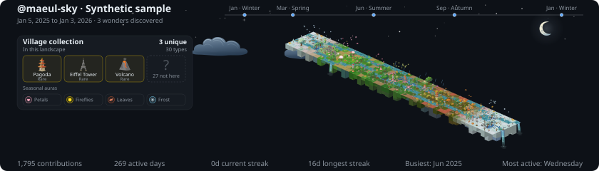
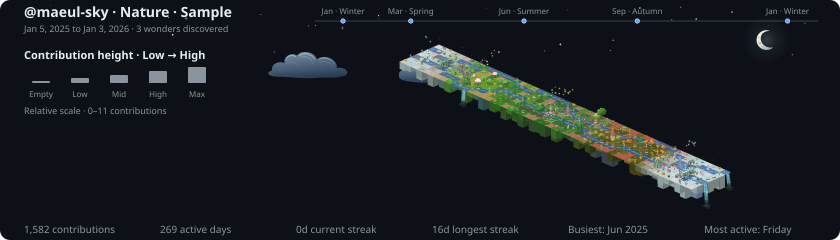
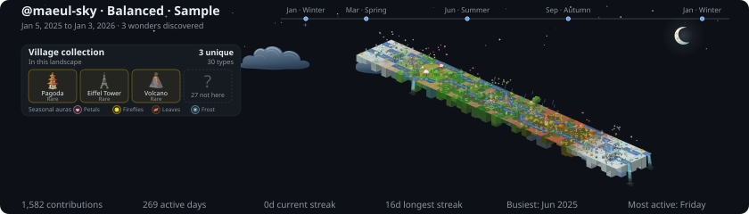

<div align="center">

# Maeul in the Sky

**Build a living isometric village from your GitHub contributions.**

[](https://www.npmjs.com/package/maeul-in-the-sky)
[](https://www.npmjs.com/package/maeul-in-the-sky)
[](https://github.com/t1seo/maeul-in-the-sky/actions/workflows/ci.yml)
[](LICENSE)

[English](README.md) · [한국어](docs/README.ko.md) · [日本語](docs/README.ja.md) · [中文](docs/README.zh.md)

<br />

<picture>
  <source media="(prefers-color-scheme: dark)" srcset=".github/assets/preview-dark.svg">
  <source media="(prefers-color-scheme: light)" srcset=".github/assets/preview-light.svg">
  
</picture>

[**Try the preset demo**](https://t1seo.github.io/maeul-in-the-sky/) · [Quick start](#quick-start) · [npm](https://www.npmjs.com/package/maeul-in-the-sky) · [Showcase](SHOWCASE.md)

</div>

Maeul (마을) means “village” in Korean. Each day in your Contribution Calendar becomes part of a floating Terrain: quiet days form water and open land, while active days grow forests, farms, villages, cities, and rare wonders.

The output is a pair of standalone SVG files. They work in profile READMEs, switch with GitHub’s color mode, and require no client-side JavaScript.

**Current `main` documentation:** the asset, season, daily-growth and art-style improvements below are not included in published npm `1.4.0` or the current `v1` Action tag. This update targets `main` and the GitHub Pages demo; use the Action at `@main` or the source-checkout commands below.

## What your village includes

- Deterministic isometric Terrain with 100 elevation levels
- Four calendar-aligned seasons with distinct foliage, silhouettes and material colors
- Procedural rivers, ponds, forests, weather, and ambient animation
- 202 ordinary asset IDs: 189 classic and 13 Korean, with 68 seasonal and 134 year-round IDs
- 30 discoverable Epic Wonders across Rare, Epic, and Legendary tiers
- Refreshed artwork for all 223 existing IDs plus 9 new Korean rural IDs: 232 in total
- Independent miniature/pixel artwork and daily rewards based on raw contribution counts
- Dark and light SVGs with accessible titles, descriptions, and reduced-motion support
- Northern and Southern Hemisphere season mapping
- Visible contribution range, active days, streaks, busiest month, and Wonder count
- Banner/card layouts, full/subtle/off motion, static PNG, and a zoomable browser explorer
- Versioned settings, contribution snapshots, multi-year comparisons, and local authenticated preview

The README previews and six preset images use seeded **synthetic data**, with 364 supplied days from **2025-01-05 to 2026-01-03**. They are examples, not a fetched account or a complete 2025 calendar. Sparse and maximum previews use separate seeded patterns; the original benchmark fixtures remain frozen for reproducible comparisons.

## Choose a village preset

Presets change the mix of extra decorations. They do not change contribution counts, elevation, colors or daily reward tiers.

|                                                             Nature                                                             |                                                               Balanced                                                               |                                                                   Civilization                                                                   |
| :----------------------------------------------------------------------------------------------------------------------------: | :----------------------------------------------------------------------------------------------------------------------------------: | :----------------------------------------------------------------------------------------------------------------------------------------------: |
| [](https://t1seo.github.io/maeul-in-the-sky/?preset=nature&mode=dark) | [](https://t1seo.github.io/maeul-in-the-sky/?preset=balanced&mode=dark) | [](https://t1seo.github.io/maeul-in-the-sky/?preset=civilization&mode=dark) |
|                                                   More forests and open land                                                   |                                                       Nature, farms, and towns                                                       |                                                      More buildings on everyday active days                                                      |
|                                                        `preset: nature`                                                        |                                                          `preset: balanced`                                                          |                                                              `preset: civilization`                                                              |

## Quick start

### 1. Add the Action

For a GitHub profile, use the repository whose name matches your username. Add `.github/workflows/maeul-sky.yml`:

These examples use `@main` for the current features. The `v1` tag still points to the older commit `1d514430`. For reproducible runs, replace `@main` with the full commit SHA you have tested; a branch name moves as updates land.

```yaml
name: Update Maeul in the Sky

on:
  schedule:
    - cron: '0 0 * * *'
  workflow_dispatch:

permissions:
  contents: write

jobs:
  generate:
    runs-on: ubuntu-latest
    steps:
      - uses: actions/checkout@v6

      - uses: t1seo/maeul-in-the-sky@main
        with:
          github_token: ${{ secrets.GITHUB_TOKEN }}
          preset: balanced

      - uses: stefanzweifel/git-auto-commit-action@v7
        with:
          commit_message: 'chore: update Maeul in the Sky'
```

The repository owner is used as the GitHub username. Set `username` explicitly when the Terrain should represent someone else.

### 2. Run it once

Open **Actions → Update Maeul in the Sky → Run workflow**. The first run creates:

- `maeul-in-the-sky-dark.svg`
- `maeul-in-the-sky-light.svg`

If the commit step is denied, open **Settings → Actions → General → Workflow permissions** and allow read and write permissions.

### 3. Add it to your README

```html
<picture>
  <source media="(prefers-color-scheme: dark)" srcset="./maeul-in-the-sky-dark.svg" />
  <source media="(prefers-color-scheme: light)" srcset="./maeul-in-the-sky-light.svg" />
  
</picture>
```

## Action reference

| Input            | Description                                              | Default                     |
| ---------------- | -------------------------------------------------------- | --------------------------- |
| `username`       | GitHub user whose Contribution Calendar is used          | Repository owner            |
| `github_token`   | Token used for the GitHub GraphQL API                    | `${{ github.token }}`       |
| `theme`          | Theme renderer                                           | `terrain`                   |
| `title`          | SVG title                                                | `@username`                 |
| `output_dir`     | Directory for both SVG files                             | `./`                        |
| `year`           | Calendar year; omit for the rolling last 52 weeks        | Rolling 52 weeks            |
| `hemisphere`     | Seasonal mapping: `north` or `south`                     | `north`                     |
| `preset`         | `nature`, `balanced`, or `civilization`                  | `balanced`                  |
| `density`        | Extra decoration mix override from 1 to 10          | Preset value                |
| `config`         | Version-1 settings JSON path                             | None                        |
| `input`          | Snapshot JSON path; skips the network request            | None                        |
| `write_snapshot` | Write a reusable snapshot: `true` or `false`             | `false`                     |
| `motion`         | `full`, `subtle`, or `off`                               | `full`                      |
| `layout`         | `banner` or `card`                                       | `banner`                    |
| `village_style`  | Cultural style: `classic` or `korean`                     | `classic`                   |
| `art_style`      | Artwork: `miniature` or `pixel`, independent of culture   | `miniature`                 |
| `layout_seed`    | Optional deterministic layout override                   | Username/year/date identity |
| `normalization`  | `relative`, `fixed`, or `shared` for multi-year archives | `relative`                  |
| `max_count`      | Positive fixed-scale maximum; requires `fixed`           | None                        |
| `format`         | `svg`, `png`, or `both`                                  | `svg`                       |
| `scale`          | Static PNG scale from 1 to 4                             | `2`                         |
| `years`          | Two to five distinct comma-separated years               | None                        |

Outputs: `dark_svg_path` and `light_svg_path` contain the default generated paths. Optional and archive runs also expose `dark_png_path`, `light_png_path`, `snapshot_path`, `archive_path`, `comparison_dark_svg_path`, and `comparison_light_svg_path` when applicable.

### Common customizations

```yaml
- uses: t1seo/maeul-in-the-sky@main
  with:
    github_token: ${{ secrets.GITHUB_TOKEN }}
    username: octocat
    preset: nature
    village_style: korean
    art_style: pixel
    hemisphere: south
    title: 'Octocat’s coding village'
```

Use `density` from 1 to 10 to vary extra scenery. The visible effect depends on available space and daily growth stages. It does not lower daily reward tiers or remove a positive day's guaranteed primary asset.

## How Terrain Generation works

Height keeps the default `relative` scale: the positive-count P90 and a square-root mapping produce levels 1–99, while zero stays 0. `fixed` uses your `maxCount` instead. Daily growth is separate and uses the original Contribution Calendar count, not just commits, normalized height or density.

| Daily contribution count | Reward tier |
| ------------------------ | ----------- |
| 0                        | 0, no reward |
| 1–4                      | 1           |
| 5–9                      | 2           |
| 10–24                    | 3           |
| 25–49                    | 4           |
| 50+                      | 5           |

Every positive day receives a primary asset, or a Wonder in its place, plus a visible tier marker. Lower tiers favor nature; higher tiers use more developed silhouettes suited to the culture and Biome. The marker remains when a Wonder occupies the date. For example, with `fixed` maximum 20, counts 25 and 50 share the maximum height but retain tiers 4 and 5.

These tiers are visual rewards, not GitHub classifications or code-quality scores. Raising a day's count cannot lower its tier. Other dates, normalization and density cannot change that tier; the whole random scene, extra decorations and global Wonder selections are not guaranteed to grow monotonically.

Counts determine terrain height. Supplied dates keep their actual UTC weekday and Sunday-based week, including partial weeks and gaps. Missing dates remain absent; known zero-count dates remain real zero days. Decorations never add contributions.

### Epic Wonders

High-activity Terrain can reveal one of 30 special landmarks:

- **Rare (14):** Mount Fuji, Giant Sequoia, Colosseum, Coral Reef, and more
- **Epic (10):** Aurora, Taj Mahal, Glacier Peak, Bioluminescent Pool, and more
- **Legendary (6):** Floating Island, Dragon Nest, World Tree, Ancient Portal, and more

Wonder selection considers the cell’s activity, the richness of nearby cells, and overall contribution statistics. Up to three Wonders are placed with spacing rules so they remain meaningful and readable.

## Explore and set up

Open the [demo](https://t1seo.github.io/maeul-in-the-sky/) to choose a preset, username/year/title and hemisphere. Controls cover density, motion, banner/card, classic/Korean culture, miniature/pixel artwork, height scale and layout seed. Culture and artwork are independent; either culture supports both art styles. Changing sample settings does not fetch an account. Import a snapshot for actual counts, or use the local service below.

Select a date to inspect its count, reward tier, Biome and placements. The explorer displays source, exact dates, total, active days, streak and a height/season legend. Zoom supports +/−/reset, keyboard panning, Escape and focus return. The [Wonder encyclopedia](https://t1seo.github.io/maeul-in-the-sky/#wonders) shows discovered/locked landmarks and their actual gates. Eligibility does not guarantee selection: spacing, neighboring terrain, chance and the maximum-three budget also apply.

The setup section downloads settings JSON, a workflow and a README snippet. Its workflow uses `t1seo/maeul-in-the-sky@main` and publishes to the `output` branch; its snippet points there, as an alternative to the main-branch quick start above. Pin a tested full commit SHA if you need a fixed version. Only the publication job receives `contents: write`. Titles or layout seeds containing `${{` cannot be exported to a workflow because GitHub evaluates Actions expressions; they remain valid in images and JSON.

## CLI

Node.js 20 or newer is required. These examples use current `main` features that are **not yet released on npm**. Build a source checkout first:

```bash
git clone --branch main https://github.com/t1seo/maeul-in-the-sky.git
cd maeul-in-the-sky
npm ci
npx tsx scripts/pixel/generate.ts --check
npm run build
```

```bash
GITHUB_TOKEN="$(gh auth token)" node dist/index.js \
  --user octocat --preset civilization --output ./terrain

node dist/index.js --input village.snapshot.json \
  --layout card --village-style korean --art-style pixel --motion off --format both --scale 2 \
  --write-snapshot --output ./terrain

GITHUB_TOKEN="$(gh auth token)" node dist/index.js \
  --user octocat --years 2024,2025 --normalization shared --output ./archive
```

| CLI flag                          | Action input     | Values / behavior                                                          |
| --------------------------------- | ---------------- | -------------------------------------------------------------------------- |
| `--user`, `-u`                    | `username`       | Account inferred from input/config; Action otherwise uses repository owner |
| `--token`                         | `github_token`   | Generation token; explicit `--token` overrides `GITHUB_TOKEN`              |
| `--theme`, `-t`                   | `theme`          | `terrain`                                                                  |
| `--title`                         | `title`          | Default `@username`                                                        |
| `--output`, `-o`                  | `output_dir`     | Default current directory                                                  |
| `--year`, `-y`                    | `year`           | Calendar year; omit for rolling 52 weeks                                   |
| `--years`                         | `years`          | 2–5 distinct comma-separated years; conflicts with `--year`                |
| `--preset`                        | `preset`         | `nature` (density 2), `balanced` (5), `civilization` (9)                   |
| `--density`                       | `density`        | Integer 1–10                                                               |
| `--hemisphere`                    | `hemisphere`     | `north` / `south`                                                          |
| `--config`                        | `config`         | Settings JSON path                                                         |
| `--input`                         | `input`          | Snapshot/archive JSON path; no network                                     |
| `--write-snapshot [path]`         | `write_snapshot` | CLI optional path; Action `true`/`false`; default off                      |
| `--motion`                        | `motion`         | `full` / `subtle` / `off`                                                  |
| `--layout`                        | `layout`         | `banner` (840×240) / `card` (420×360)                                      |
| `--style`, `--village-style`      | `village_style`  | `classic` / `korean`                                                       |
| `--art-style`                     | `art_style`      | `miniature` / `pixel`; independent artwork, default `miniature`           |
| `--normalization`                 | `normalization`  | `relative` / `fixed` / `shared` (archive only)                             |
| `--max-count`                     | `max_count`      | Positive finite maximum; required with `fixed`, invalid without it         |
| `--layout-seed`                   | `layout_seed`    | Optional deterministic seed override                                       |
| `--format`                        | `format`         | `svg` / `png` / `both`; default `svg`                                      |
| `--scale`                         | `scale`          | Integer PNG scale 1–4; default 2                                           |
| `--help`, `-h`; `--version`, `-V` | —                | CLI help/version                                                           |

Run `node dist/index.js --help` and `node dist/index.js preview --help` for this checkout. Invalid/conflicting options fail with field-specific errors.

Defaults remain `terrain`, `balanced`, density `5`, `north`, `classic`, `full`, `banner`, relative P90 and a rolling range; artwork defaults to `miniature`. Render settings resolve in this order: explicit CLI/Action/UI field → loaded settings → selected preset defaults → library defaults. In single-render CLI/API calls, `--config` supplies loaded settings in preference to snapshot settings; they are not merged field by field. An explicit preset alone does not replace saved density. Omitted flags do not override saved settings. Format and PNG scale are output options, not saved render settings.

The default still writes `maeul-in-the-sky-dark.svg` and `maeul-in-the-sky-light.svg`. Optional output adds matching `.png` files and `maeul-in-the-sky.snapshot.json`. With `--format png`, SVG path results are empty strings. Additional Action outputs are `dark_png_path`, `light_png_path`, `snapshot_path`, `archive_path`, `comparison_dark_svg_path` and `comparison_light_svg_path`.

### Local preview with your account

```bash
GITHUB_TOKEN="$(gh auth token)" node dist/index.js preview --port 4318
```

Open `http://127.0.0.1:4318/` and select **Fetch contributions**. The service binds loopback only and reads its token from the server environment. There is no browser token field: do not place tokens in links, JSON or forms. The static public demo imports JSON and never contacts your localhost service. Missing credentials produce an actionable error; upstream errors are sanitized. The local process caches account/year responses for five minutes, up to 32 entries.

## Saved data, comparisons and privacy

Settings (`kind: maeul-settings`), snapshots (`maeul-snapshot`) and archives (`maeul-archive`) use `schemaVersion: 1`. Settings contain username, optional year and render settings. Snapshots add year, date/count/level weeks and `source.kind` (`github`, `import`, `sample`), with optional `fetchedAt`. Parsers recompute statistics, reject unsupported versions, duplicate/invalid dates and invalid counts/options, and limit imports to 2 MiB and 20,000 days across at most 20 snapshots.

The envelope stays at version 1. Settings save culture as `style: classic | korean` and artwork as `artStyle: miniature | pixel`; older settings without `artStyle` load as `miniature`. Both choices survive settings/snapshot imports, share links and archive generation.

**Save current year** stores a snapshot in this browser's local storage. Replacing a saved username/year requires confirmation. Compare 2–5 years of one account: the default pools positive counts across selected snapshots, takes their P90 and stores that common maximum as fixed normalization in the archive manifest. Equal counts then have equal levels/heights. An explicit fixed maximum overrides it; individual relative views remain available outside comparisons. CLI archives contain year directories with images/snapshots, `archive.json` and two vertically stacked `maeul-in-the-sky-comparison-{dark,light}.svg` files. Replay with `--input archive.json`; `--normalization shared` recomputes the pooled scale.

Settings links contain configuration, including username/title, but no counts, token or snapshot payload. They do not fetch the named account. Snapshots/archives contain daily counts and dates and may reveal private activity totals visible to your token; review them before sharing. Source labels record provenance, not cryptographic proof of GitHub origin. There is no analytics, account database or telemetry endpoint. Network generation contacts GitHub directly; imports work offline. SVGs contain dates/counts, not repository names or contribution details, and no executable scripts or external resources.

## Layout, motion and stable villages

Dark and light shade one prepared scene with matching geometry, ordinary assets and Wonders. New scenes emit `layoutVersion: 2`, using normalized username, optional `layoutSeed` and absolute dates for deterministic random identities. Existing version-1 scenes remain renderable; regenerating them uses version 2 and can change placements. With fixed normalization and unchanged local context, overlapping interior dates retain terrain and ordinary placements when a rolling range shifts; screen positions move with the window. Relative P90 can change heights, neighbors can change eligibility, and the global Wonder budget can change selections. Different settings/ranges or layout versions need not produce identical pixels. Source timestamps do not affect placement.

Seasons follow real dates and hemisphere: spring flowers and new leaves, full summer foliage, autumn color and harvests, winter snow and bare branches. Seasonal material colors reinforce those silhouettes. Korean culture retains `hanok`, `pavilion`, `stoneWall` and `onggi`, adding `choga`, `jangseung`, `sotdae`, `riceTerrace`, `koreanWatermill`, `hanokGate`, `kimchiGarden`, `stoneBridge` and `hanokEstate`. Higher-tier ordinary rewards use Korean rural architecture, with paths between eligible neighborhood buildings. Counts and Wonder gates stay unchanged.

`artStyle` changes artwork while preserving selected IDs, dates, counts and reward tiers. The default `miniature` uses detailed SVG artwork; `pixel` uses compiled SVG paths on a logical **0.5 SVG-unit grid**, with a limited palette whose colors still adapt to season and dark/light mode. Pixel asset rendering needs no runtime Resvg or external bitmap. The grid describes asset geometry, not physical screen pixels: scene fitting and external fractional scaling can soften edges or prevent exact pixel alignment.

Both banner and card retain the full supplied period. Card places larger statistics around fitted terrain. API `width`/`height` set display dimensions; `layout` sets the logical viewBox. SVGs retain accessible title/description. `full` enables ambient effects; `subtle` limits motion to slow clouds and gentle water; `off` omits CSS animations/keyframes and SMIL. Reduced-motion preference selects a visible static fallback. PNG always rerenders with `motion: off`, an opaque mode background and scale 1–4 (default 2); it is static. Node uses bundled resvg WASM and Noto Sans KR; browser export uses SVG/canvas, so rasterization and available fonts can differ.

## JavaScript and browser API

The published npm package remains the **legacy 1.4.0 release**, without the improvements documented above:

```bash
npm install maeul-in-the-sky@1.4.0
```

For the **current `main` API**, build the source checkout as shown above and run the following as an `.mjs` file in its root:

```js
import { generateTerrain, generateArchive } from './dist/lib.js';

const result = await generateTerrain({
  username: 'octocat',
  token: process.env.GITHUB_TOKEN,
  preset: 'balanced',
  layout: 'card',
  style: 'korean',
  artStyle: 'pixel',
  motion: 'off',
  format: 'both',
  writeSnapshot: true,
  outputDir: './terrain',
});
console.log(result.darkPath, result.lightPath, result.darkPngPath, result.snapshotPath);

await generateArchive({
  username: 'octocat',
  token: process.env.GITHUB_TOKEN,
  years: [2024, 2025],
  normalization: 'shared',
  outputDir: './archive',
});
```

The source build provides `dist/lib.js` (ESM), `dist/lib.cjs` (CommonJS) and `dist/browser.js` (portable ESM). The browser entry exports rendering, parsers, settings, snapshot/archive helpers, catalogs and TypeScript types without Node filesystem, token client or WASM rasterizer dependencies. Given JSON from your file input, import the built browser entry:

```js
import {
  parseSnapshot,
  snapshotToContributionData,
  renderTerrain,
  prepareTerrainScene,
  renderTerrainScene,
} from './dist/browser.js';

export function renderSavedVillage(snapshotJson) {
  const snapshot = parseSnapshot(snapshotJson);
  const data = snapshotToContributionData(snapshot);
  const options = {
    ...snapshot.settings,
    style: 'korean',
    artStyle: 'pixel',
    layout: 'card',
    motion: 'off',
  };
  const { dark, light, metadata } = renderTerrain(data, options);
  const scene = prepareTerrainScene(data, options);
  const inlineDark = renderTerrainScene(scene, 'dark', { namespace: 'profile-village' });
  return { dark, light, metadata, inlineDark };
}
```

`renderTerrain` returns SVGs and metadata covering dates, statistics, normalization and actual placements. `TerrainScene` is JSON-safe. Use distinct namespaces for multiple identical inline scenes. Portable and Node inputs accept `style` or `villageStyle`; conflicting aliases are rejected. Canonical v1 settings serialize as `style`. Types `TerrainRenderOptions` and `TerrainSceneRenderOptions` are exported. Existing `Theme.render` still returns only `{ dark, light }`.

Custom Theme archive comparisons parse SVG and CSS locally, including namespace prefixes and character references. XML declarations and DOCTYPEs are removed when embedding each row. External DTDs and custom entities are not loaded; malformed XML or unsupported references raise `InputValidationError` before archive files are written. If adding prefixes makes reference values indistinguishable so a CSS attribute selector cannot preserve its original matches, the same error is raised before writing.

Local stylesheet selectors are restricted to their annual row so generic rules keep row-specific paint references. This is SVG composition, not a CSS encapsulation boundary: imported styles, global names such as keyframes and fonts, and selectors that depend on an external document retain their existing CSS semantics. Custom themes should keep those names unique and their styling self-contained.

## Catalog and reproducible previews

The [interactive catalog](https://t1seo.github.io/maeul-in-the-sky/catalog/) groups assets by domain, season and culture, with separate Wonder tiers and a miniature/pixel selector. It includes all 13 Korean IDs. Counts and SVG/PNG sheets come from the renderer registries: **202 ordinary IDs = 189 classic + 13 Korean**; 68 are seasonal and 134 are year-round. **30 Wonders = 14 Rare + 10 Epic + 6 Legendary**, counted separately, for **232 total IDs**. Variants, art styles and instances do not increase ID totals.

After editing artwork, regenerate the compiled pixel assets. Check for drift before tests or builds, then regenerate the previews/catalog:

```bash
npx tsx scripts/pixel/generate.ts
npx tsx scripts/pixel/generate.ts --check
npx tsx scripts/generate-preview.ts
npx tsx scripts/generate-demo.ts
npx tsx scripts/generate-examples.ts
npx tsx scripts/generate-cases.ts
npx tsx scripts/generate-catalog.ts docs/demo/catalog
```

Generators use fixed seeds and UTC dates. The early-activity case supplies known zeros after five active weeks; it is not a partial import. Offline previews use guarded geometry/path optimization. The earlier optimization experiment saved 16.54–17.06% gzip on six captured SVGs, with small subpixel differences. Those measurements predate this artwork update; they do not measure its size, rendering speed or FPS. See [measured rendering and SVG size](docs/demo/performance.md) for the historical inputs, rejected approaches and limits.

## Troubleshooting

- **Action publication denied:** check the job's `contents: write`, repository workflow permissions and branch protections.
- **Wrong account or dates:** set `username`/`--user` and `year`/`--year`; a sample stays a sample until data is loaded.
- **No motion:** check `motion`, reduced-motion preference and the host's SVG policy. Static terrain remains visible.
- **Private activity missing:** only counts visible to the supplied token are available.
- **Import fails:** use version-1 JSON, unique valid dates and nonnegative integer counts within the limits above.
- **Local fetch fails:** set `GITHUB_TOKEN` in the server environment and open its exact loopback URL.

See [Support](SUPPORT.md) or [open an issue](https://github.com/t1seo/maeul-in-the-sky/issues/new/choose).

## Community

- Share a profile in the [Showcase](SHOWCASE.md)
- Read the [contribution guide](CONTRIBUTING.md)
- Report vulnerabilities through the [security policy](SECURITY.md)
- Follow the [code of conduct](CODE_OF_CONDUCT.md)

## License

[MIT](LICENSE) © [t1seo](https://github.com/t1seo)
