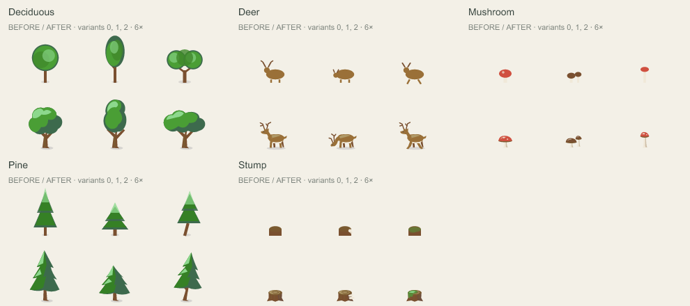
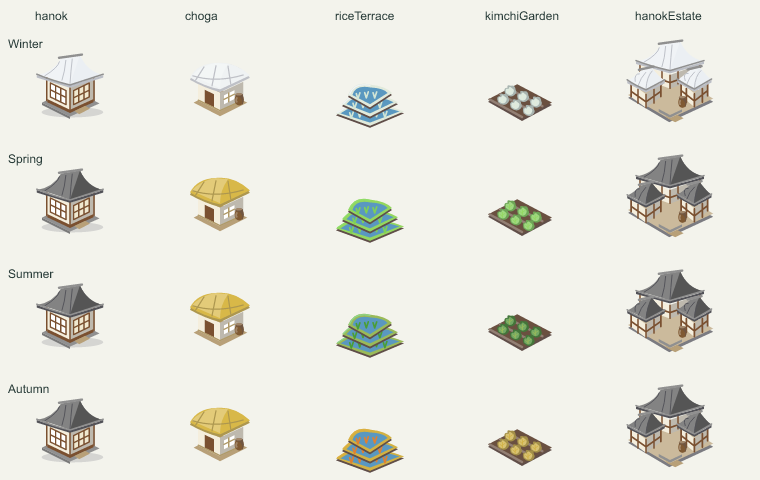
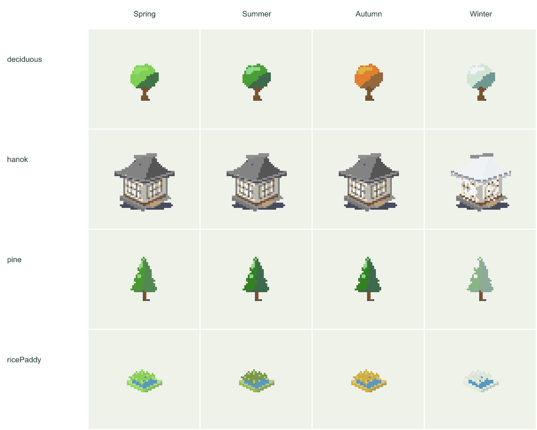
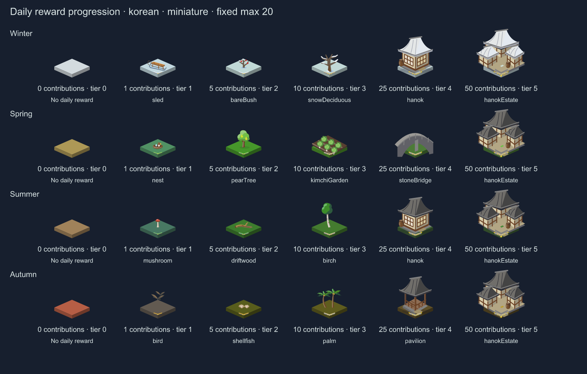

# 에셋 품질·사계절 개편 결과

기존 223종의 ID를 모두 유지하면서 원화를 개편하고 한국 시골 9종을 추가했습니다. 일반 202종과 Wonder 30종, 총 232종을 미니어처와 픽셀 두 그림체에서 사용할 수 있습니다. 픽셀은 0.5 SVG 단위 격자의 636개 변형 슬롯을 미리 생성하며 실행 중 외부 이미지나 래스터 변환기를 사용하지 않습니다.

## 실제 그림의 변화

고정된 이전 팔레트로 밝은/어두운 모드와 일반 자산의 3변형을 비교했습니다. 기존 223종의 1,218개 표본 모두 SVG와 실제 래스터 이미지가 변경됐습니다. 이는 변경 범위의 증거이며 품질은 확대·실제 크기 전후 이미지를 별도로 검토했습니다.

[Wonder 30종 전후 비교](asset-quality-overhaul-evidence/wonders-before-after.png)에서도 실루엣·재질·입체감을 확인하실 수 있습니다. 새 한국형 ID는 `choga`, `jangseung`, `sotdae`, `riceTerrace`, `koreanWatermill`, `hanokGate`, `kimchiGarden`, `stoneBridge`, `hanokEstate`입니다.

봄에는 꽃과 새잎, 여름에는 짙은 녹음, 가을에는 단풍·수확물, 겨울에는 흰 지면·잎·지붕이 드러납니다. 목재·벽·동물의 색은 계절별 일괄 착색으로 흐려지지 않습니다. 소나무와 야자수는 가을에도 녹색 명암을 유지합니다. 계절은 입력 날짜와 남북반구를 따릅니다.

## 활동량과 결과물

일별 원본 GitHub 기여 수의 0 / 1 / 5 / 10 / 25 / 50 경계에서 보상 단계가 바뀝니다. 이는 커밋만의 집계나 코드 품질 점수가 아닙니다. 기여가 있는 날에는 주 에셋 또는 해당 위치의 Wonder와 단계 표식이 남으며, 높은 단계에는 더 발달한 건축·물가 자산이 보장됩니다. 한국형 상위 단계는 한옥 대저택·한국 물레방아 계열을 사용합니다.

높이 정규화·다른 날짜의 기여 수·장식 설정이 일별 보상 단계를 낮추지 않습니다. 전체 무작위 장면이나 Wonder 개수까지 단조 증가한다는 보장은 없습니다. 장식은 주 에셋과 겹치지 않는 작은 요소로 제한했고, 원래 큰 에셋은 주 후보에서도 나오도록 하여 일반 202종 모두의 선택 도달성을 검증했습니다.

설정의 문화(`classic`/`korean`)와 그림체(`miniature`/`pixel`)는 독립적입니다. 옛 설정은 미니어처로 읽습니다. 새 배치의 메타데이터는 `layoutVersion: 2`이며 옛 장면의 렌더링도 유지합니다. 장식 슬라이더는 주변 구성에 영향을 주며 실제 효과는 성장 단계와 여유 공간에 따라 달라집니다.

## 비용과 기준 변경

아래는 같은 기기·Node/V8·입력·설정에서 20회 준비 실행 후 100회 측정한 어두운/밝은 SVG 한 쌍의 중앙값입니다. 원본은 보존한 `2b608bc` 소스에서 다시 실행했습니다. PNG·네트워크·디스크·모듈 최초 로딩은 시간에 포함되지 않습니다. SVG 수치는 어두운 모드이며 gzip은 레벨 9입니다.

| 입력 | 처리 시간 이전 → 이후 | 원본 SVG 이전 → 이후 | gzip 이전 → 이후 | SVG 요소 이전 → 이후 |
| --- | ---: | ---: | ---: | ---: |
| 활동 없음 | 14.35 → 14.63 ms | 478,479 → 517,900 B | 68,257 → 70,161 B | 5,620 → 5,552 |
| 혼합 활동 | 18.42 → 22.46 ms | 643,271 → 945,057 B | 99,618 → 134,798 B | 7,761 → 10,606 |
| 매일 높은 활동 | 23.15 → 30.75 ms | 1,078,607 → 1,742,317 B | 145,825 → 170,890 B | 13,615 → 19,509 |

품질과 매일 보장되는 결과물이 늘어난 만큼 기존 +5% 크기 예산은 통과하지 못했습니다. 큰 보조 건물 겹침 제거, 좌표 정밀도 제한, 같은 색의 보상 도형 병합을 먼저 적용했습니다. 마지막 병합은 40개 RGBA 비교에서 픽셀이 동일했고 고활동 장면의 요소 1,456개를 줄였습니다. 그 뒤 측정한 결과를 이번 기능의 새 기준으로 채택했으며 향후 +5% 크기·+20% 중앙값·+30% p95 회귀 한도는 유지합니다. 렌더링 속도가 향상됐다고 주장하지 않습니다.

[재현 정보와 전체 비교 수치](asset-quality-overhaul-evidence/performance.json)에는 소스 해시, 환경, 입력 해시, 양 색상의 수치와 최적화 전 결과가 포함되어 있습니다. 초기 보존 측정의 Node 26.8.1과 통합 환경의 Node 26.0.0이 달라, 위 표는 원본을 Node 26.0.0으로 재측정한 비교를 사용했습니다.

픽셀 그림체는 얇은 선과 미세 장식을 단순화하며 작은 연간 카드에서는 여러 논리 픽셀이 화면 한 픽셀로 합쳐질 수 있습니다. 각 자산의 변형 포즈는 정적이고 배경 날씨 등 장면 효과는 별도로 작동합니다. 복잡한 픽셀 윤곽은 미니어처보다 SVG 바이트가 늘 수도 있습니다.

## 검증 기록

통합 소스를 고정한 상태에서 132개 파일의 1,842개 테스트가 통과했습니다. 실제 브라우저 기반 Vitest 검증을 포함하며 문장 96.50%, 분기 93.12%, 함수 98.11%, 줄 97.80%의 커버리지를 확보했습니다. 타입 검사·ESLint·Prettier·의존성 보안 검사도 통과했고 알려진 의존성 취약점은 0건이었습니다.

배포 패키지는 Node 20에서 CLI·ESM/CJS 공개 API·PNG·보관함·로컬 미리보기를, Node 24에서 별도 `node_modules` 없이 GitHub Action을 실행했습니다. 패키지 브라우저 API는 실제 Chromium에서 확인했습니다. 픽셀 원화 일치, 232종 도감 생성물 일치, 밝은/어두운 모드의 모든 일반 변형·Wonder 실제 알파 경계 검사도 통과했습니다.

Playwright는 Chromium·Firefox·WebKit 각각의 데스크톱·390px 모바일·모션 감소 설정, 총 9개 프로젝트에서 282개를 통과했습니다. Chromium 전용 터치 입력 검사에 해당하는 나머지 브라우저의 6개 조합은 기존 조건에 따라 제외했습니다. 밝은/어두운 정적 승인 이미지도 재생성 후 직접 검토했습니다. 새 기능 기준을 대상으로 한 독립 성능 재실행은 입력·소스 안정성·크기·의미·처리 시간의 기존 회귀 한도를 모두 통과했습니다.

다섯 독립 검토(목표·실제 사용·코드·보안·기존 맥락)가 모두 PASS였습니다. 별도 Chromium 데스크톱/390px 터치 환경의 실제 사용 시나리오 29개와 도감 928개 표현 경계를 확인했습니다. 발견 사항·보정·검토 한계는 [독립 검토 기록](asset-quality-overhaul-evidence/review.md)에 정리했습니다.

## 연구 및 재현

[실행 계획](asset-quality-overhaul-2026-09-19.md), [아트 규칙](asset-art-direction-2026-09-19.md), [기존 에셋 조사](asset-redesign-research-2026-09-19.ko.md), [공식 자료 중심 추가 조사](asset-quality-followup-research-2026-09-19.ko.md)를 함께 남겼습니다. Townscaper·Dorfromantik의 구획과 실루엣, 한국 전통 마을의 배치, 픽셀 격자 규칙을 참고했고 외부 에셋이나 새 런타임 엔진을 도입하지 않았습니다.

원화 수정 후에는 `npm run generate:pixel`로 생성한 뒤 `npm run check:pixel`로 일치 여부를 확인합니다. 빌드와 CI가 오래된 픽셀 생성물을 거부합니다. 도감은 `npm run generate:catalog`와 `npm run check:catalog`, 데모는 `npm run generate:demo`로 재현합니다.

공개 대상은 프로젝트 `main`의 GitHub Action 번들과 Pages입니다. npm `1.4.0` 및 기존 `v1` 태그는 이번 기능이 포함된 릴리스가 아니며, 사용자 프로필에는 검증된 새 커밋 SHA를 고정합니다.
