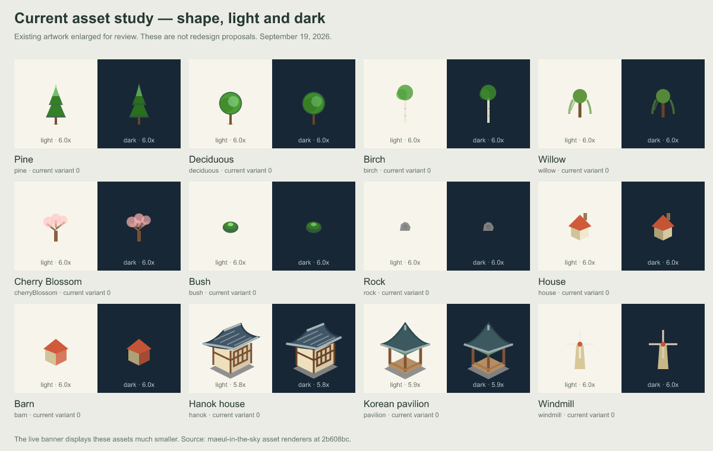

# 나무·건물 에셋 디자인 개편 리서치

조사일: 2026-09-19 · 코드 기준: `2b608bcfda7746723dd1af30c554e3c944afd32b`

## 판단

**현재 구조에서 나무·집·바위 등의 모양을 상당히 크게 바꿀 수 있습니다.** 색상 조정뿐 아니라 실루엣, 비율, 지붕과 수관의 형태, 입체감, 계절 표현까지 교체할 수 있습니다. 개별 에셋이 SVG 생성 함수로 분리되어 있어, 기존 배치와 기여도 계산을 유지하면서 그림을 다시 제작하는 방식이 가능합니다.

추천하는 방향은 **한국풍 건축과도 잘 어울리는 둥글고 포근한 미니어처 SVG**입니다. 나무는 덩어리감과 종류별 실루엣을 살리고, 건물은 지붕·벽·기단의 명암을 통일하는 접근입니다. 아래 디자인 평가는 현재 에셋과 참고작을 살펴본 연구자의 판단이며, 사용자 선호가 확정된 결과는 아닙니다.

가장 중요한 제약은 그림을 그리는 기술보다 **아주 작은 실제 표시 크기와 223종 전체의 일관성**입니다. 먼저 나무·집·한옥 3종으로 방향을 비교하고, 선택한 방향을 대표 12종에 적용해 실제 마을에서 확인하는 순서를 권합니다.

## 1. 현재 구조와 확인한 수치

| 항목 | 확인 결과 | 개편에 주는 의미 |
| --- | --- | --- |
| 일반 에셋 | 193종: classic 189, korean 4 | 기존 ID를 유지하고 그림을 교체할 수 있습니다. |
| 특별 건축물/Wonders | 30종 | 일반 나무·집과 별도로 복잡한 형태를 다듬어야 합니다. |
| 계절 전용 에셋 | 일반 193종 중 68종 | 별도 추가 68종이 아닙니다. 기본 형태와 계절 파생형을 함께 정리해야 합니다. |
| woodland 분류 | 43종 | 나무·식생 계열의 통일만으로도 반복되는 풍경의 인상을 바꿀 여지가 큽니다. |
| 렌더링 | SVG path/polygon/circle 등 생성 함수 | PNG를 찾아 교체하는 구조가 아니라 벡터 도형을 바꾸는 구조입니다. |
| 색상 | 팔레트 인자를 전달 | 형태와 색상 역할을 분리하면 밝은/어두운 모드에 대응하기 좋습니다. |
| 변형 | variant 인자로 0·1·2를 사용 | 모든 에셋이 세 가지 다른 그림을 갖는 것은 아닙니다. 필요한 가족부터 변형을 설계할 수 있습니다. |
| 바닥 투영 | 타일 폭 16, 높이 7 SVG 단위 | 시판 2:1 아이소메트릭 팩을 그대로 넣으면 각도와 접지점이 어긋날 수 있습니다. |

근거: [카탈로그](../src/themes/terrain/assets/catalog.ts), [렌더러 목록](../src/themes/terrain/assets/renderers.ts), [렌더링 계약](../src/themes/terrain/assets/types.ts), [투영](../src/themes/terrain/scene/projection.ts), [직접 계산한 인벤토리](asset-redesign-research-2026-09-19/inventory-and-scale.json).

### 현재 그림에서 보이는 개선점

아래 이미지는 **현재 그림의 확대 관찰용 자료이며 새 디자인 시안이 아닙니다.** 원본 렌더러를 사용해 대표 12종의 variant 0을 밝은/어두운 배경에서 생성했습니다. 벚꽃에는 봄 팔레트를 사용했습니다.

- 소나무는 삼각형 층, 활엽수와 자작나무는 둥근 수관, 버드나무는 가는 가지 위주라 형태를 더 풍성하게 표현할 여지가 있습니다.
- 기본 집과 헛간의 형태가 비슷합니다. 지붕 비율·문·처마 중 한두 가지 큰 특징으로 구별하는 편이 작은 크기에 적합합니다.
- 한옥·정자는 기본 집보다 구조와 디테일이 풍부합니다. 자연물과 일반 건물에도 비슷한 수준의 조형 규칙을 적용하되, 상대 크기와 화면 밀도는 함께 검토해야 합니다.
- 개별 확대 화면에서의 아름다움과 마을 전체에서의 가독성은 별개입니다. 확대 이미지에만 맞춰 세밀하게 그리면 실제 배너에서는 대부분 사라질 수 있습니다.

### 실제 크기 계산

기존 `mixed-2025`와 `full-2025` fixture를 불러와 장면 배치와 `fitScene`을 계산했습니다. 아래는 소나무의 **여유 공간을 포함한 bounds 높이 15 SVG 단위**를 화면 크기로 환산한 값입니다. 채색된 나무 자체는 이보다 작으며, 브라우저 스크린샷을 픽셀 단위로 측정한 결과는 아닙니다.

| 표시 조건 | mixed | full |
| --- | ---: | ---: |
| 가로 배너, 원래 폭 840px | 11.85px | 11.12px |
| 가로 배너를 폭 390px로 축소 | 5.50px | 5.16px |
| 카드 레이아웃을 폭 390px로 표시 | 9.43px | 8.85px |

**실루엣과 큰 명암을 먼저 개선해야 하는 이유입니다.** 잎맥·작은 창틀·기와 한 장씩의 표현은 후순위입니다. 현재의 배너와 카드를 모두 검토하고, 확대 보기에서는 추가 디테일이 보이는 수준을 목표로 잡는 것이 적절합니다.

근거: [화면 맞춤 계산](../src/themes/terrain/scene/bounds.ts), [계산 결과와 조건](asset-redesign-research-2026-09-19/inventory-and-scale.json).

## 2. 어느 정도까지 바꿀 수 있나

| 개편 수준 | 가능한 변화 | 작업 범위와 제약 |
| --- | --- | --- |
| 색감·명암 정리 | 팔레트, 광원 방향, 그림자, 명암 단계 통일 | 가장 작은 범위입니다. 실루엣이 비슷한 문제는 남습니다. |
| 개별 에셋 재제작 | 풍성한 나무, 둥근 집, 개성 있는 지붕, 한옥 처마, 바위 면 분할 | **추천 범위입니다.** SVG 함수와 bounds, 시각 기준 이미지를 갱신합니다. |
| 전체 아트 스타일 교체 | 모든 자연물·건물·장식·Wonders를 하나의 스타일로 통일 | 기술적으로 가능하지만 가족별 변형·계절·밝은/어두운 모드 검토량이 큽니다. |
| 픽셀아트 전환 | 정교한 도트 나무·집·타일 | 이미지 제작 외에 정수 배율과 픽셀 정렬을 검토해야 합니다. 현재 소수 좌표와 자동 축소는 불리합니다. |
| 3D로 만든 2D 그림 | 점토·장난감·로우폴리 모델을 고정 각도로 렌더링 | 가능합니다. 투영각·그림자·이미지 크기·색상별 파생본·SVG 내 포함 방법을 검증해야 합니다. |
| 실시간 3D | 자유 회전, 카메라, 실제 조명과 입체 모델 | 에셋 교체를 넘어 웹 렌더링 구조가 바뀝니다. README용 정적 출력 경로도 필요합니다. |

기존 `style: classic/korean`은 건축물 선택 풀을 바꾸는 설정입니다. 임의의 그림체를 교체하는 스킨 시스템은 아직 아닙니다. 기존 그림과 새 그림을 선택 가능하게 제공하려면 문화적 스타일과 구분되는 `artStyle` 또는 에셋 버전 개념을 설계하는 편이 좋습니다. 이 경우 설정 저장·불러오기, CLI/Action, 데모 UI까지 범위가 늘어납니다.

한 번의 전체 교체라면 별도 스킨 설정 없이 기존 ID와 배치 규칙을 유지할 수 있습니다. 다만 저장된 기여도 스냅샷을 다시 그릴 때 새 그림이 적용되므로, 과거 그림까지 그대로 재현해야 한다면 아트 버전 관리가 필요합니다.

## 3. 벤치마킹할 방향

### A. 둥글고 포근한 미니어처 — 가장 추천

**Townscaper**에서는 큰 색면, 지붕과 벽의 명확한 구분, 반복되어도 산만하지 않은 건물 비율을 참고할 만합니다. 공식 홍보 이미지의 작은 타일 무늬까지 옮기기보다, 이 프로젝트의 표시 크기에 맞게 큰 형태만 해석하는 것이 좋겠습니다. [공식 Steam 페이지](https://store.steampowered.com/app/1291340/Townscaper/), [퍼블리셔가 공개한 이미지가 있는 공지](https://store.steampowered.com/news/app/688420/view/3082144548427582902).

**Dorfromantik**은 제작사가 손으로 그린 보드게임 같은 미술 방향을 설명합니다. 공식 이미지에서는 나무의 높이와 덩어리가 조금씩 다르고, 자연물·건물·농지가 하나의 장면으로 어울립니다. 여기서는 **수관 모양의 차이와 자연물 군집의 색 조화**를 참고하는 것이 적합하다는 판단입니다. [제작사 게임 소개](https://www.toukana.com/dorfromantik), [공식 프레스킷](https://www.toukana.com/dorfromantik/presskit).

프로젝트에 적용할 구체적인 변화:

- 소나무: 세모를 규칙적으로 포개는 형태에서, 폭과 기울기가 조금 다른 3개의 수관 덩어리로 바꿉니다.
- 활엽수: 하나의 원 대신 비대칭으로 겹친 3~5개의 큰 덩어리와 짧은 줄기를 사용합니다.
- 자작나무: 가는 흰 줄기와 위로 긴 수관을 유지해 활엽수와 구별합니다.
- 버드나무: 가는 선 몇 개에 의존하기보다 아래로 처진 큰 수관 실루엣을 만듭니다.
- 집·헛간: 지붕 경사와 처마 길이를 구별하고, 읽히는 크기의 문 또는 창문 하나를 강조합니다.
- 한옥·정자: 휘어진 처마와 기둥 비율을 중심 특징으로 유지하고, 다른 건축물과 광원·그림자 규칙을 맞춥니다.
- 꽃·덤불·바위: 작은 점과 선을 늘리기보다 큰 덩어리와 2~3단계 명암을 사용합니다.

이 추천은 참고작의 그래픽을 복사하는 제안이 아니라, 자체 에셋 제작에 사용할 조형 원칙입니다.

### B. 간결한 로우폴리·종이 모형풍 — 기존 구조와 잘 맞음

곡선보다 면과 색의 차이로 입체감을 만드는 방향입니다. 현재 polygon 기반 건물과 자연물을 발전시키기 좋아, 둥근 미니어처 방향과 함께 초기 비교안으로 적합합니다.

**Kenney Nature Kit**은 3D 자연물 330개를 제공하며 제작자 페이지에 CC0로 표시되어 있습니다. 수종별 실루엣과 바위의 면 분할을 참고하기 좋습니다. 다만 3D 팩이므로 현재 SVG 함수에 그대로 꽂을 수 있는 파일은 아닙니다. [제작자 공식 페이지](https://kenney.nl/assets/nature-kit).

**Kenney Isometric Miniature Farm**은 2D 아이소메트릭 농장 팩 60개이며 CC0로 표시되어 있습니다. 농장·건물·자연물의 크기 관계를 참고할 수 있습니다. 실제 재사용 전에는 다운로드 파일의 형식과 앵커·투영각을 확인해야 합니다. [제작자 공식 페이지](https://kenney.nl/assets/isometric-miniature-farm).

### C. 선명한 픽셀아트 — 취향은 뚜렷하나 별도 설계 필요

작은 게임 마을 같은 분위기에 적합합니다. 다만 현재의 16×7 투영과 소수 좌표, 레이아웃별 자동 배율을 유지하면 도트 간격이 고르게 보이지 않을 수 있습니다. 에셋만 바꾸기보다 정수 배율과 출력 크기를 함께 정하는 작업입니다.

제작 도구로는 Aseprite의 프레임·스프라이트 시트·배치 내보내기가 맞습니다. [공식 스프라이트 시트 문서](https://www.aseprite.org/docs/sprite-sheet/), [공식 CLI 문서](https://www.aseprite.org/docs/cli/).

### D. 점토·장난감·수채화풍 — 가능하지만 제작 파이프라인이 커짐

3D 모델을 고정 각도로 촬영하거나 손그림 이미지를 제작해 사용할 수 있습니다. 특히 Blender의 직교 투영은 원근감 없는 고정 시점 그림을 만드는 데 활용할 수 있습니다. [Blender 공식 투영 문서](https://docs.blender.org/manual/en/4.2/editors/3dview/navigate/projections.html).

장면 확대 시의 질감은 풍부해지지만, 여러 해상도와 계절·모드별 이미지 관리가 필요합니다. SVG에 비트맵을 포함하는 방식은 파일 크기와 현재 PNG 내보내기 경로에서 먼저 검증해야 합니다. 라이브 3D 엔진을 추가하지 않고 오프라인 제작 단계에서만 3D를 쓰는 선택도 가능합니다.

### Mobbin에서 확인한 보조 참고

게임 에셋 자체는 게임 제작사 자료가 더 직접적인 참고였습니다. Mobbin에서는 [Zillow의 주택·풍경 일러스트](https://mobbin.com/screens/6a133906-a7e9-4623-ad43-520a04a4da69)에서 적은 색과 큰 형태, [Airbnb의 기프트카드 선택 화면](https://mobbin.com/screens/c32a3937-843c-4759-a8b9-cca38e2e27b0)에서 일러스트 분위기를 비교하는 방식을 확인했습니다. 둘 다 이 프로젝트에 바로 사용할 아이소메트릭 에셋 팩은 아닙니다.

## 4. 도구와 라이브러리 선택

| 용도 | 적합한 도구 | 이 프로젝트에서의 사용 방식 |
| --- | --- | --- |
| 벡터 원화·스타일 가이드 | Figma 또는 Inkscape | 그림을 제작한 후 SVG 좌표·팔레트·앵커를 프로젝트 규칙으로 정리합니다. |
| 현재 렌더러 통합 | 기존 TypeScript SVG 함수 | 새 런타임 라이브러리 없이도 도형과 색상 역할을 바꿀 수 있습니다. |
| SVG 정리 | 기존 SVGO 오프라인 경로 | 제작 파일의 불필요한 데이터를 줄이고 실제 출력 차이를 확인합니다. |
| 픽셀아트 | Aseprite | 프레임과 계절 파생본을 관리하고 스프라이트 시트로 내보냅니다. |
| 3D 기반 원화 | Blender + 필요시 Kenney 모델 | 고정 카메라·광원으로 렌더링한 뒤 2D 출력물로 통합합니다. |
| 아이디어 탐색 | 이미지 생성 도구 | 분위기와 수종·건물 형태 비교에 사용할 수 있습니다. 최종 벡터의 일관성·좌표·색상은 별도 정리가 필요합니다. |

Figma는 SVG 내보내기를 지원하지만, 내보낸 파일이 곧바로 현재의 팔레트·계절·모션 계약을 만족하지는 않습니다. 예를 들어 stroke가 fill로 변환되는 내보내기 동작까지 고려해 경로 수와 크기를 확인해야 합니다. [Figma 공식 내보내기 문서](https://help.figma.com/hc/en-us/articles/13402894554519-Export-formats-and-settings-for-static-designs).

Inkscape는 명령줄 내보내기를 제공하므로 에셋 일괄 변환에 활용할 수 있습니다. [공식 CLI 문서](https://wiki.inkscape.org/wiki/Using_the_Command_Line).

**이번 목표만으로 Three.js·PixiJS·Phaser 같은 웹 렌더링 엔진을 도입할 필요는 없습니다.** SVG 그림체 개선에는 기존 렌더러로 충분합니다. 이미지로 사용하는 SVG에서는 JavaScript와 외부 리소스에 제약이 있으므로, 현재의 독립적인 SVG 출력 특성을 보존하는 것이 유리합니다. 외부 PNG 주소를 참조하는 방식 대신 자체 포함 등의 방법이 필요하며, 대상 출력 경로에서 검증해야 합니다. [MDN: SVG를 이미지로 사용할 때의 제한](https://developer.mozilla.org/en-US/docs/Web/SVG/Guides/SVG_as_an_image).

시판 팩 중 PNG 형식이 확인된 예는 Kenney의 Isometric Landscape입니다. 제작자가 128개의 개별 PNG와 스프라이트 시트, 3D 제작 후 2D 렌더링 방식을 명시했습니다. 이 역시 현재 타일 각도와 계절 팔레트에 자동으로 맞는 것은 아닙니다. [제작자 직접 게시물](https://opengameart.org/content/isometric-landscape).

## 5. 성능과 호환성에서 챙길 부분

1. **도형을 교체하는 것과 도형을 계속 추가하는 것은 비용이 다릅니다.** 기존 원·삼각형을 몇 개의 잘 설계된 path로 바꾸는 접근부터 비교합니다. 그림자 필터·마스크·세부 선·애니메이션을 모든 나무에 늘리는 접근은 별도로 측정해야 합니다.
2. **크기를 키우면 다른 에셋도 작아질 수 있습니다.** 전체 장면 bounds를 뷰포트에 맞추므로, 경계의 큰 에셋이 장면 크기를 늘리면 마을 전체 배율이 낮아집니다. 밀집도·가림·겹침과 함께 검토해야 합니다.
3. **그림체 교체만으로 성능 향상을 보장할 수 없습니다.** 카탈로그 종류 수보다 실제 장면의 인스턴스 수, SVG 요소·바이트 수, 애니메이션이 직접적인 비용에 가깝습니다.
4. **현재의 모션 제한과 정적 출력을 유지합니다.** 나무 흔들림을 새로 넣는다면 렌더러 외에 움직일 에셋 선택과 예산도 검토해야 합니다.
5. **기존 시각 검증은 의도적으로 갱신해야 합니다.** classic 189종의 variant별 정확한 해시를 검증하는 테스트가 있어, 그림을 바꾸면 기존 기준과 달라지는 것이 정상입니다. 새 원화를 검토한 뒤 기준을 갱신하고, bounds·배치 안정성 검증은 유지합니다.

프로젝트의 기존 성능 보고서에서는 full 장면 SVG 한 개가 원본 약 1.08MB, gzip 약 143KB였고, dark/light 한 쌍 생성 중앙값이 22.40ms였습니다. **이는 2026-09-13의 기존 환경 측정값이며, 이번 리디자인의 성능이나 모든 기기의 속도가 아닙니다.** 이번 조사에서는 새 디자인을 구현하거나 성능 측정을 다시 하지 않았습니다. [기존 측정 보고서](../docs/demo/performance.md).

기존 프로젝트 실험에서 `defs/use`의 gzip 이득은 약 0.23~0.25%에 그쳤습니다. 따라서 “스프라이트나 공통 심볼로 바꾸면 크게 빨라진다”는 가정으로 시작하지 않는 편이 좋습니다. 오프라인 SVG 최적화 역시 이미지 차이와 추가 처리 비용이 있었으므로 기존 검증 경로를 활용합니다.

## 6. 권장 제작 순서와 범위

### 1차: 대표 3종으로 그림체 결정

소나무·기본 집·한옥을 다음 세 방향으로 비교합니다.

- 둥근 미니어처: 부드러운 수관과 포근한 건물 비율.
- 면 중심 미니어처: 간결한 다각형과 뚜렷한 명암.
- 한국 시골 강조: 자연스러운 소나무와 처마·담장 중심의 건축 조형.

세 번째는 재료 표현보다 문화적 분위기의 차이이므로, 선택한 기본 그림체와 결합할 수도 있습니다. 픽셀아트를 선호하는 경우에는 이 단계에서 한 방향을 픽셀아트로 대체하고 축소 품질부터 확인합니다.

### 2차: 선택한 방향을 대표 12종에 적용

`pine`, `deciduous`, `birch`, `willow`, `cherryBlossom`, `bush`, `rock`, `house`, `barn`, `hanok`, `pavilion`, `windmill`을 권합니다. 수관·가지·꽃·바위·지붕·한옥·움직이는 구조물을 포함해 전체 확장 전에 주요 문제를 드러낼 수 있는 구성입니다.

원화 기준에는 접지점, 크기 범위, 광원 방향, 명암 단계, 팔레트 역할, 그림자 범위, 허용 디테일을 포함합니다. 먼저 variant 0으로 통일감을 확인하고, 필요한 에셋에 2~3가지 결정적 변형을 확장합니다.

### 3차: 실제 마을에서 검증 후 가족별 확장

검토 조건은 확대 카탈로그, 840px 배너, 390px로 축소한 배너, 390px 카드, 밝은/어두운 모드, 관련 계절, 밀집 장면, 모션 off/full입니다. 그림이 잘리거나 겹쳐 중요한 형태가 사라지는지 확인하고, 동일 데이터에서 배치·ID·기여도 해석이 유지되는지도 검증합니다.

승인한 대표 형태를 바탕으로 나무 → 낮은 자연물 → 일반 건축물 → 한국 건축물 → 계절 파생형 → Wonders 순으로 확장하는 것이 적절합니다. Wonders의 세부 원화는 일반 집의 스타일 기준을 확정한 뒤 맞춥니다.

### 작업량의 대략적인 범위

아래는 **숙련 작업자의 디자인·SVG 통합·검수 시간을 합한 초기 추정 인일**입니다. 하루 약 6시간의 집중 작업, 검토 1~2회, 기존 배치 유지, 신규 실시간 3D 엔진 없음이 전제입니다. 각 행은 대안별 총범위이며 합산하지 않습니다. 실제 제작 속도를 측정한 견적이 아니고, 첫 3종 제작 후 재산정해야 합니다.

| 범위 | 초기 추정 | 포함하는 작업 |
| --- | ---: | --- |
| 색감·광원 규칙 중심 정리 | 2~4인일 | 팔레트와 대표 형태의 명암 조정·검토 |
| 대표 3종 × 3방향 비교 | 2~4인일 | 그림체 탐색, 기본 SVG 시안, 실제 크기 비교 |
| 대표 12종 완성 | 5~10인일 | 방향 확정, 통합, 관련 모드·계절 검토, 일부 변형 |
| 주요 30~40종 개편 | 12~25인일 | 자연물·일반 건축물 중심, 필요한 계절 파생형과 QA |
| 일반 193종 + Wonders 30종 전체 | 35~70인일 | 가족별 원화·변형·계절 정리, bounds·카탈로그·시각·성능 검수 |

223종은 완전히 독립적인 원화 223장을 처음부터 그린다는 뜻은 아닙니다. 계절·같은 가족 사이의 공유로 줄일 수 있는 작업이 있고, 복잡한 Wonders와 애니메이션 때문에 늘어나는 작업도 있습니다. 기존/신규 그림체를 선택하는 기능, 픽셀아트 전환, 3D 제작 파이프라인은 위 추정의 별도 범위입니다.

## 최종 추천

**기존 SVG 엔진을 유지하고, 둥근 미니어처 방향으로 나무·건물의 실루엣과 입체감을 먼저 개편하는 것이 가장 적합합니다.** 색상만 바꾸는 것보다 변화가 크면서도, 현재의 계절·밝은/어두운 모드·SVG/PNG 출력 기능을 이어가기 좋습니다.

첫 구현 단위는 전체 223종이 아니라 **방향 비교용 3종 → 대표 12종**을 권합니다. 작은 표시 크기에서 형태가 분명해지고 마을 전체가 어울리는지 확인한 다음, 그 규칙을 나머지 에셋에 적용하면 됩니다.
