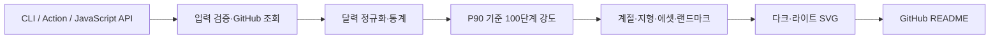

# Maeul in the Sky 개선 리서치

조사일: 2026-09-13. 로컬 기준: `c6d60487e50347fd84b770b57618d181acd874de`, package version `1.4.0`.

이 문서는 프로젝트 파악, 실제 결과물 확인, 성능 기준선 측정, 경쟁 프로젝트·라이브러리·디자인 사례 조사의 결과입니다. 제품 코드를 수정하거나 배포하지 않았습니다. 현재 체크아웃에는 CHANGELOG의 `Unreleased` 개선도 포함되어 있으므로, 아래의 “현재 기능”이 npm이나 배포된 `v1`에 모두 포함되어 있다고 가정하지 않습니다.

## 1. 추천 방향

**표현 요소를 더 늘리기 전에, 내 활동이 읽히고 내 마을로 느껴지며 쉽게 설치되는 경험을 완성하는 편이 효과가 크겠습니다.**

추천 순서는 다음과 같습니다.

1. 부분 주의 날짜 위치 오류를 수정해 데이터와 지형의 대응을 보장합니다.
2. 라이트 미리보기 배경과 모바일 가독성을 개선합니다.
3. 설정 선택에서 Action YAML·README 코드 복사까지 연결합니다.
4. 같은 마을의 낮과 밤을 유지하고, 실제 측정에 따라 생성·표시 비용을 개선합니다.
5. 도감·연도별 기록·한국 마을 스타일을 차별화 실험으로 검토합니다.

실제 사용자 인터뷰나 설치 전환율 자료는 없으므로, 제품 효과와 선호도는 가설입니다. 코드·화면·계측으로 확인한 사실은 아래에서 따로 표시합니다.

## 2. 프로젝트 이해

GitHub Contribution Calendar를 개인의 활동 패턴에 맞춘 아이소메트릭 SVG 마을로 바꾸는 생성기입니다. CLI, GitHub Action, JavaScript API가 같은 `generateTerrain` 진입점을 사용합니다.

이미 갖춘 기반은 상당히 좋습니다.

- 상대 활동량의 P90과 제곱근 곡선으로 강도를 계산해 일부 극단값에 전체 마을이 눌리지 않도록 합니다.
- 계절·남북반구·프리셋 3개·밀도 조절·Epic Wonders·다크/라이트가 있습니다.
- 독립 SVG여서 README에서 클라이언트 JavaScript 없이 사용할 수 있습니다.
- 접근성용 `<title>`·`<desc>`·`role="img"`와 reduced-motion 처리가 있습니다.
- `getTheme(...).render(data, options)`가 공개되어 있어 데이터 기반 렌더링 API도 이미 존재합니다.
- 정적 SVG 6개를 전환하는 데모가 있고, 프리셋과 모드를 URL로 공유할 수 있습니다.
- 테스트, 타입 검사, 린트, 패키지 smoke-test CI, 다국어 README가 있습니다.

근거: [공개 API](../src/lib.ts), [공통 생성기](../src/generate.ts), [정규화](../src/core/calendar.ts), [강도·통계 표시](../src/themes/shared.ts), [데모](../docs/demo/index.html).

## 3. 실제로 확인한 개선 지점

### A. 날짜가 주 중간부터 시작하면 지형 위치가 밀립니다

**재현한 정확성 문제입니다.** `contributionGrid`는 실제 날짜의 요일을 좌표에 반영하지만, `toIsoCells`가 날짜와 기존 좌표를 사용하지 않고 배열을 다시 7개씩 나눕니다.

| 날짜 | 기대 위치 | 실제 위치 |
|---|---|---|
| 2025-01-01 수요일 | 0번째 주, 수요일 | 0번째 주, 일요일 |
| 2025-01-05 일요일 | 1번째 주, 일요일 | 0번째 주, 목요일 |

1월 1~4일의 부분 주와 다음 주 7일을 넣은 사례에서 11개 날짜 모두 위치가 어긋났습니다. 첫 주를 2024-12-29 일요일부터 완전한 주로 구성한 대조군은 14개 모두 일치했습니다. 기존 테스트 595개는 통과하므로, 달력 정규화부터 최종 지형 좌표까지 이어지는 검증을 추가할 가치가 큽니다.

근거: `src/themes/shared.ts:155`, `src/themes/terrain/blocks.ts:43`. [좌표 변환 코드](../src/themes/terrain/blocks.ts).

**개선 기준:** 일요일부터 토요일까지 모든 시작 요일, 연초·연말의 부분 주, 53주 입력에서 날짜별 week/day가 일치해야 합니다. 데이터가 없는 날을 기여 0일과 혼동하지 않도록 구분해야 합니다.

### B. 라이트 미리보기의 배경이 어둡게 유지됩니다

**브라우저에서 확인한 데모 표시 문제입니다.** 모드 전환은 SVG 파일만 교체하고 `.preview`의 어두운 배경은 유지합니다. 투명 배경의 라이트 SVG에 있는 어두운 제목과 통계가 잘 읽히지 않습니다. GitHub 자체의 라이트 표시까지 문제가 있다고 확인한 것은 아닙니다.

근거: `docs/demo/index.html:128`, `docs/demo/index.html:304`. [데스크톱 캡처](research-assets-2026-09-13/desktop-light.png), [모바일 라이트 캡처](research-assets-2026-09-13/mobile-light.png).

**개선안:** 미리보기 영역의 배경도 선택한 모드와 함께 바꾸고, 밝은·어두운 README 배경에서 각각 결과물을 검수합니다. 전체 웹사이트 테마까지 전환해야 하는 것은 아닙니다.

### C. 모바일에서는 마을과 통계가 너무 작습니다

**브라우저 크기와 화면을 확인했습니다.** 390px 너비의 데모에서 SVG 표시 폭은 340px, 높이는 약 97px입니다. 내부 10px 통계 글자는 `10 × 340 / 840 = 약 4.05 CSS px`로 축소됩니다. 실제 휴대전화의 성능을 측정한 것이 아니라 데스크톱 브라우저의 뷰포트를 변경한 결과입니다.

가로 넘침은 없었고 프리셋·모드 버튼도 작동했습니다. 문제는 반응형 배치의 부재가 아니라, 연간 풍경과 텍스트를 한 장으로 함께 축소하는 방식입니다.

근거: `src/themes/shared.ts:97`, `docs/demo/index.html:137`. [모바일 다크 캡처](research-assets-2026-09-13/mobile-dark.png).

**추천 실험:** 웹 데모에서는 SVG 바깥에 핵심 통계 2~3개를 읽기 쉬운 HTML로 표시하고 마을 확대 보기를 제공합니다. README용으로는 전체 연도를 유지한 배너와 통계를 재배치한 카드형 출력을 비교합니다. 최근 26주 모드는 기간이 달라지는 별도 선택 기능으로 취급하며, 연간 통계를 그대로 붙이지 않습니다.

### D. 다크·라이트에서 마을 배치 자체가 달라집니다

**코드에서 확인한 현재 설계이며, 곧바로 버그로 분류하지 않습니다.** 지형·일반 에셋에 쓰는 seed가 `hash(username + mode)`여서 모드를 바꾸면 강·숲·건물 선택도 달라집니다.

근거: `src/themes/terrain/index.ts:87`, `:117`, `:152`. [렌더러](../src/themes/terrain/index.ts).

**추천:** 모드와 무관한 배치 seed를 먼저 검토해 “같은 마을의 낮과 밤”을 제공합니다. 이후 필요하면 지형·에셋 배치를 한 번 계산한 공통 장면 데이터로 만들고 모드별 색상·조명·하늘만 렌더링합니다. 단순 seed 수정으로 가능한 범위와 구조 개편은 별도 작업으로 추정해야 합니다.

같은 전체 입력을 다시 넣었을 때의 재현성과, 하루가 지나도 기존 마을이 유지되는 안정성은 다릅니다. 후자를 원한다면 날짜별 seed뿐 아니라 rolling range의 좌표 이동, P90 변화, 이웃 셀 조건까지 다뤄야 합니다.

## 4. 성능 기준선과 개선 방향

### 현재 측정

환경은 Apple M1, macOS arm64, Node `26.8.1`, npm `11.19.0`입니다. CI의 모든 Node 버전과 동일한 결과라는 뜻은 아닙니다.

52주·364일 fixture에 대해 `theme.render`로 다크·라이트 한 쌍을 생성했습니다. 시나리오별 준비 실행 20회 후 100회 측정했습니다. GitHub 요청, 디스크 출력, CLI 시작, 브라우저 렌더링은 제외했습니다.

재현 입력은 `tests/fixtures/contribution-data.ts`의 `createEmptyContributionData()`, `createMockContributionData()`(Mulberry32 seed 42), `createFullContributionData()`입니다. 기간은 2024-12-29~2025-12-27, 데이터의 year는 2025입니다. 옵션은 `{ title: '@benchmark', width: 840, height: 240 }`이며 density·hemisphere는 기본값 5·north입니다. 같은 프로세스에서 empty→mixed→full 순으로 실행했고, 표의 중앙값·p95는 정렬된 100개 표본의 50번째·95번째 값입니다. 프로세스 격리·명시적 GC는 하지 않아 공유 머신의 다른 작업과 GC에 영향을 받을 수 있습니다.

| 입력 | 기여 수 | 중앙값 | p95 |
|---|---:|---:|---:|
| 모두 0 | 0 | 21.35ms | 42.49ms |
| 혼합 활동 | 803 | 23.35ms | 49.37ms |
| 모든 날 활동 | 7,280 | 31.21ms | 58.24ms |

체크인된 SVG 파일의 별도 측정입니다. 위 시간 측정 fixture와 동일한 입력은 아닙니다.

| 결과물 | 원본 | gzip | XML 요소 | CSS 대상 + SMIL 태그 |
|---|---:|---:|---:|---:|
| `preview-dark.svg` | 283,539B | 50,060B | 3,273 | 20 + 12 |
| `preview-max-light.svg` | 381,045B | 62,398B | 4,605 | 21 + 27 |

gzip은 로컬 압축 결과로, GitHub나 Pages에서 실제 전송된 바이트를 측정한 값은 아닙니다. CSS 대상과 SMIL 태그의 합은 구조상의 개수이며, 독립적으로 동시에 움직이는 객체 수나 브라우저 부하와 같지 않습니다.

**해석:** 이 입력 크기에서는 생성에 수초가 걸리는 병목은 확인되지 않았습니다. 3천~4천여 요소도 그 자체로 느리다는 증거는 아닙니다. 모바일의 페인트 시간·프레임 드롭·에너지 사용은 따로 측정해야 합니다.

### 권장하는 최적화 순서

| 후보 | 프로젝트에 맞는 이유 | 판단 기준 |
|---|---|---|
| 성능 회귀 기준선 | 현재 시간·파일 크기가 기록되어 있지 않으면 개선 판단이 어렵습니다 | 고정 fixture별 생성 시간, raw/gzip, 요소 수를 CI에서 기록 |
| 계절 팔레트 계산 재사용 | 52주×2모드의 팔레트 생성과 색상 변환이 반복됩니다 | 유효 범위가 제한된 캐시 또는 색상 계산 중복 제거 후 측정 |
| 공통 계산 재사용 | dark/light마다 grid·강도·biome 등을 반복하고, 블록에서도 isoCells를 재계산합니다 | 결과 배치 계약을 정한 뒤 전후 CPU·메모리 비교 |
| 수치 출력 정리·SVGO | 반복 좌표와 SVG 표현을 정리할 여지가 있습니다 | 원본과 gzip 모두 비교하고 색·텍스트·모션·참조가 보존되는지 확인 |
| 정적 에셋 `defs/use` | 반복되는 나무·건물 도형을 공유할 수 있습니다 | 작은 실험부터 시작, 모양·색·변환·가림 순서 검증 |
| `motion: full / subtle / off` | OS reduced-motion 외에도 사용자가 결과물의 움직임을 선택합니다 | API→CLI→Action→실제 SVG까지 옵션 일관성 검증 |

`<use>`는 내부적으로 복제된 렌더링 구조를 사용하므로 파일 감소가 같은 비율의 페인트 감소를 뜻하지 않습니다. 현재 `nature`와 `civilization`의 dark 파일도 각각 278,758B와 289,352B로 큰 차이가 없어, 프리셋을 성능 모드로 취급하면 안 됩니다. [SVG use 설명](https://developer.mozilla.org/en-US/docs/Web/SVG/Reference/Element/use).

추가 탐색 실험에서는 긴 소수를 두 자리로 반올림한 메모리상의 문자열이 `preview-dark`의 gzip을 50,060B→41,359B, 약 17.4% 줄였습니다. `preview-max-light`도 약 17.2% 줄었습니다. 실제 파일을 수정하지 않았고 시각적 동등성 검증도 하지 않았으므로, 곧바로 적용 가능한 최적화 결과가 아니라 수치 직렬화 정리의 가능성을 보여주는 자료입니다.

이 탐색은 SVG 전체에서 소수부 5자리 이상인 숫자 문자열을 치환했으며 좌표·CSS·기타 속성을 구분하지 않았습니다. 구현 시 이런 전역 정규식 치환을 그대로 사용하기보다, 의미가 확인된 수치 속성의 직렬화 단계 또는 검증된 SVG 변환에 적용해야 합니다. 용량은 `Buffer.byteLength()`와 옵션 없는 `zlib.gzipSync()` 기준입니다.

계절 팔레트 104회 생성만 별도로 측정한 중앙값은 16.33ms였습니다. 전체 렌더링과 독립적으로 측정한 값이므로 전체 시간의 특정 비율을 차지한다고 단정할 수는 없지만, 우선 프로파일링할 후보입니다. 또한 `preview-dark`의 95개 요소에 `filter:brightness(1.3)`이 있으므로 색상 사전 계산과 비교해볼 수 있습니다. 이 필터가 브라우저 병목인지는 측정하지 않았습니다. 근거: `src/themes/terrain/palette.ts:1026`, `src/themes/terrain/blocks.ts:170`.

## 5. 경쟁 프로젝트에서 가져올 부분

성능 비교 실행은 하지 않았습니다. 아래는 공식 문서·저장소에서 확인한 제품·설치·표현 방식 비교입니다. 이름이 같은 프로젝트가 있어 저장소를 명시했습니다.

| 참고 대상 | 확인한 특징 | Maeul 적용 아이디어 |
|---|---|---|
| [Platane/snk](https://github.com/Platane/snk/blob/a041d6c27ba561a39f5be9c26a784812765e434b/README.md) | 뱀이 기여 칸을 먹는 명확한 애니메이션, SVG/GIF, 데모, SVG 전용 Action | 한 가지 대표 움직임을 중심에 두기, SVG 기본 출력과 추가 포맷 비용 분리 |
| [lowlighter/metrics](https://github.com/lowlighter/metrics/blob/65836723097537a54cd8eb90f61839426b4266b6/README.md) | 플러그인형 통계, 웹 미리보기, 여러 실행·출력 방식 | 미리보기→설정→복사, 핵심 통계와 상세 정보의 위계 |
| [github-profile-3d-contrib](https://github.com/yoshi389111/github-profile-3d-contrib/blob/9e3f937195cf840d364388973f73e3c4b3753586/README.md) | 3D SVG, 정적·애니메이션 스타일, JSON 설정, 연도·Enterprise endpoint | 달력·높이의 판독성, 공유 가능한 설정 파일, Enterprise 수요 확인 |
| [rishabhbhartiya/GitCity](https://github.com/rishabhbhartiya/GitCity/blob/f01554aabbfb9a04416f94abe4fd0e435a87bdbc/README.md) | 사용자명으로 시작하는 호스팅 체험, 도시·히트맵, URL 공유, embed | 내 마을 즉시 체험, README 이미지에서 큰 탐색 화면으로 연결 |
| [honzaap/GithubCity](https://github.com/honzaap/GithubCity) | Three.js 기반 기여 도시, 브라우저 탐색 | 확대할수록 볼거리가 있는 건물군 구성, 별도 탐색 페이지 |
| [github/gh-skyline](https://github.com/github/gh-skyline/blob/5245b2fc95250075cac37d24a4cd9b09258de5a8/README.md) | GitHub CLI 확장, 여러 연도, STL, ASCII 미리보기 | 연도별 마을 보관·비교와 소장 경험 |

Metrics의 [isocalendar](https://github.com/lowlighter/metrics/blob/65836723097537a54cd8eb90f61839426b4266b6/source/plugins/isocalendar/README.md)는 반년·1년 표현을, [preset 설계](https://github.com/lowlighter/metrics/blob/65836723097537a54cd8eb90f61839426b4266b6/source/plugins/core/README.md)는 기본값·프리셋·사용자 설정의 우선순위를 참고할 만합니다.

계절·남반구·과거 연도·프리셋·프로그램 API는 Maeul에도 있으므로 경쟁 제품을 보고 새 기능으로 제안하지 않았습니다. 핵심은 이미 있는 기능을 사용자가 발견하고 활용하는 흐름입니다.

코드나 에셋을 복사하는 안은 조사 범위가 아닙니다. 특히 GitCity의 검색 요약과 현재 [LICENSE](https://github.com/rishabhbhartiya/GitCity/blob/f01554aabbfb9a04416f94abe4fd0e435a87bdbc/LICENSE)가 일치하지 않아, 문서상의 UX 참고와 코드 재사용 판단을 분리했습니다.

## 6. 디자인 방향

### 마을을 읽을 수 있는 구도

현재 840×240 풍경은 길고 대각선으로 놓여 있어 연간 활동을 한 화면에 담기 좋지만, 작은 화면에서는 각 에셋의 개성이 사라집니다. 신규 에셋 수보다 다음 조정의 우선순위가 높겠습니다.

- 기본 배너와 큰 탐색 화면을 연결하고, 웹에서는 상세 통계를 SVG 밖에서 표시합니다.
- 물·숲·주거·랜드마크의 크기와 대비를 구분해 주요 시선이 분산되지 않도록 합니다.
- 랜드마크 주변에 여백을 두고, 작은 입자·불빛이 주 피사체보다 두드러지지 않는 안을 비교합니다.
- 월·계절 구획과 낮음→높음 범례를 보강하되, 100단계를 100가지 범례로 설명하지 않습니다.
- 높이는 활동량, 색은 계절도 나타낸다는 사실을 설명합니다. 서로 다른 연도·사람을 비교할 때는 공통 척도 옵션을 검토합니다.

### Townscaper에서 참고할 점

[Townscaper 공식 소개](https://store.steampowered.com/app/1291340/Townscaper/)는 인접 배치에 따라 집·아치·계단·다리·정원이 만들어지는 경험을 설명합니다. Maeul에는 건물을 더 많이 놓기보다 **인접한 건물이 작은 동네로 보이게 하는 규칙**을 적용해 볼 만합니다.

예를 들어 주거 셀 3~4개가 모이면 지붕색이나 작은 길로 관계를 보여주고, 물가에는 선착장, 빈 땅에는 광장을 배치하는 방식입니다. 이는 제안이며, 개별 날짜의 데이터 의미를 바꾸거나 기존 물·지형을 가리는 규칙이 되지 않도록 검증해야 합니다. Townscaper의 에셋을 가져오자는 제안은 아닙니다.

### Mobbin에서 실제 화면을 확인한 패턴

활동 시각화 웹 화면 5개를 검색해 이미지를 확인했고, 관련성이 높은 세 사례를 골랐습니다. 업무용 대시보드의 외형 전체보다 정보 전달 방식이 참고 대상입니다.

| 화면 | 화면에서 관찰한 점 | 적용 제안 |
|---|---|---|
| [Slack Analytics](https://mobbin.com/screens/1e11bb3c-ced3-488e-b626-7740408eabaa) | 기간 선택·Export가 그래프 위에 있고, hover에 실제 수치와 기간이 함께 나타납니다 | 웹 탐색 화면의 날짜·기여량 설명과 다운로드 위치 |
| [Confluence Activity](https://mobbin.com/screens/977ba314-56e4-4b3d-a195-641e74b7e834) | 상단에 집계 주기·기간·갱신 안내, 카드에 큰 수치와 작은 추이 그래프가 있습니다 | “어느 기간의 데이터인가”를 쉽게 확인, 요약 수치와 풍경 크기 분리 |
| [Amplitude](https://mobbin.com/screens/b584804b-9aa7-446d-8986-5cf57c80d589) | 상단에 목적별 템플릿을 가로로 보여주고 아래에 결과 패널이 있습니다 | 기존 세 프리셋을 출발점으로 유지하고 고급 옵션은 이후에 노출 |

hover·확대·클릭 설명은 별도 웹 화면의 기능입니다. README의 `` 안에서는 JavaScript와 외부 리소스에 제약이 있으므로, 이를 SVG 안에 웹 앱처럼 넣는 방식은 맞지 않습니다. [SVG 이미지 제약](https://developer.mozilla.org/en-US/docs/Web/SVG/Guides/SVG_as_an_image).

## 7. 도입을 검토할 라이브러리·도구

| 도구 | 적합한 사용처 | 도입 판단 |
|---|---|---|
| [SVGO](https://svgo.dev/docs/preset-default/) | 출력 SVG 최적화 | 작은 샘플로 먼저 실험. gzip 감소와 시각적 동등성을 함께 검증 |
| [Playwright](https://playwright.dev/docs/test-snapshots) | 브라우저별 렌더링·모바일 배치·모드 전환·이미지 회귀 | 테스트 개수 확대보다 지금 발견된 표시 문제를 검출하는 데 가치가 큼 |
| [pixelmatch](https://github.com/mapbox/pixelmatch) | 렌더된 PNG의 픽셀 차이 확인 | Playwright의 기본 시각 비교를 쓰면 별도 직접 도입은 필요하지 않을 수 있음 |
| [resvg-js](https://github.com/thx/resvg-js) | 정적 PNG 내보내기, 썸네일·공유 이미지 | 정적 출력에 적합. 애니메이션 재생·브라우저 호환 검증의 대체재가 아님 |
| [Culori](https://culorijs.org/) | 지각적 색 공간 보간, 팔레트·명도·색각 시뮬레이션 | 디자인·빌드 도구부터 적용하고, SVG에는 sRGB HEX를 출력하는 안 추천 |
| [OKLCH Picker](https://oklch.com/) | 계절별 색상과 명도·채도 조절 | 라이브러리 추가 없이 팔레트 방향을 먼저 실험 가능 |

세부 주의점도 공식 문서에서 확인했습니다.

- SVGO v4는 `removeViewBox`·`removeTitle`을 기본 preset에서 제외했습니다. “기본값이 무조건 제목과 viewBox를 없앤다”는 설명은 현재 기준으로 틀립니다. [v4 변경점](https://svgo.dev/docs/migrations/migration-from-v3-to-v4/).
- `cleanupIds`는 기본적으로 `<style>`·`<script>`가 있으면 작업을 중단하며, `force`는 파괴적인 변경을 만들 수 있습니다. Maeul의 CSS·SMIL·접근성 ID 참조를 보존하는 설정을 검증해야 합니다. [cleanupIds](https://svgo.dev/docs/plugins/cleanupIds/).
- `reusePaths`는 같은 `d`·`fill`·`stroke`를 가진 path를 재사용합니다. 절대 좌표가 모두 다른 에셋을 자동으로 동일 템플릿으로 만들어주지는 않습니다. [reusePaths](https://svgo.dev/docs/plugins/reusePaths/).
- resvg는 애니메이션을 지원하지 않습니다. 움직이는 출력의 GIF·영상화에는 별도의 시간별 프레임 캡처가 필요합니다. [resvg 지원 범위](https://github.com/linebender/resvg/blob/main/README.md).
- 시각 회귀는 OS·브라우저·폰트·모션 시점을 고정해야 의미가 있습니다. CSS만 정지시켜 SMIL까지 검증됐다고 판단하지 않아야 합니다. [Playwright 시각 비교](https://playwright.dev/docs/test-snapshots).
- Culori에는 보간·gamut mapping·WCAG 대비·색각 시뮬레이션 기능이 있습니다. OKLCH 사용 자체가 대비 기준 충족을 보장하지는 않습니다. [Culori API](https://culorijs.org/api/).

**현재 핵심 렌더러를 Three.js로 바꾸는 것은 우선 권하지 않습니다.** 별도 3D 탐색 제품을 만들 때의 후보입니다. SVGRenderer도 텍스처·그림자·고급 셰이딩에 제약이 있어, 기존 그림을 그대로 더 좋게 만드는 교체재로 볼 수 없습니다. [Three.js SVGRenderer](https://threejs.org/docs/pages/SVGRenderer.html).

## 8. 기능과 구조 확장 후보

### 우선 검토: 설치 마법사

현재 데모에서 자연스럽게 이어지는 흐름입니다.

`프리셋 선택 → 제목·반구·연도 설정 → 미리보기 → Action YAML / README picture 복사`

먼저 샘플 데이터와 정적 설정 생성만으로도 구현할 수 있습니다. 입력값의 YAML·HTML escaping, 잘못된 사용자명·연도 안내, URL 복원까지 검증하면 됩니다. 선택한 프리셋이 복사된 설정에도 반영되어야 합니다.

사용자명을 입력해 실제 GitHub 데이터를 즉시 표시하는 것은 별도 단계입니다. 기존 GraphQL 조회에는 토큰이 필요하므로 공개 Pages의 정적 프론트엔드만으로 해결되는 작업으로 추정하지 않습니다. 서버 측 조회·캐시를 운영하거나, 사용자가 로컬에서 생성한 JSON snapshot을 가져오는 방식을 비교할 수 있습니다.

### 차별화 가설: 도감·기록·한국 마을

| 아이디어 | 사용자 가치 가설 | 먼저 필요한 것 |
|---|---|---|
| Wonder 도감 | 어떤 랜드마크가 왜 등장했는지 알아보는 재미 | 종류·등급·날짜를 담는 metadata, 별도 웹 설명 |
| 연도별 마을 보관·회고 카드 | 한 해의 활동을 기록하고 공유 | 연도 선택은 기존 기능 활용, 비교 척도와 seed 정책 정리 |
| 설정 저장·공유 | 마음에 드는 마을 스타일을 재사용 | 버전 있는 JSON 설정, 옵션 우선순위 정의 |
| 한옥·정자·돌담·장독대 등 한국 마을 스타일 | “Maeul”이라는 이름과 연결되는 시각적 정체성 | 몇 개의 에셋으로 먼저 선호도·작은 크기 판독성 검증 |
| 활동이 적은 사람의 풍경 | 기여가 적어도 보기 좋은 마을 | 기여를 부풀리지 않는 수면·정원·여백 디자인 |

도감·타임랩스·멀티플레이·3D 프린팅을 동시에 확장하기보다, 설치 완료와 공유에 도움이 되는 한 가지 경험을 먼저 선택하는 편이 좋겠습니다.

### 기능을 뒷받침할 구조

- **브라우저 진입점:** 기존 `Theme.render`를 재사용하되 Node 파일 I/O와 분리된 package export를 검토합니다. 새 렌더링 API를 처음부터 다시 만들 필요는 없습니다.
- **에셋 catalog:** 약 6천 줄의 `assets.ts`에서 선택 규칙·도형·계절 정보를 나누고, 에셋별 크기·분류·미리보기를 생성합니다. README의 118개와 실제 union의 189개는 집계 범주가 다를 수 있으므로, 정의를 정한 뒤 자동 집계합니다.
- **API 안정성:** timeout, rate-limit·인증·서버 오류 구분, 응답 구조 검증을 보강할 여지가 있습니다. 현재 장애를 관측한 것은 아닙니다. 근거: `src/api/client.ts:90`, `:135`.
- **깊이 정렬:** 일반 에셋 뒤에 랜드마크를 모두 그리므로 가림 순서가 자연스러운지 fixture로 확인할 만합니다. 실제 겹침 결함은 이번 조사에서 확정하지 않았습니다.

## 9. 실행 우선순위와 완료 기준

아래 규모는 저장소 조사에 따른 상대 추정입니다. 구현 일정이나 성능 개선율을 보장하는 수치가 아닙니다.

| 순서 | 결과물 | 규모 | 확인할 완료 기준 |
|---|---|---|---|
| 1 | 부분 주 좌표 정확성 | 작음~중간 | 시작 요일 7종, 부분 주·53주·연도 경계에서 날짜와 좌표 일치 |
| 2 | 라이트 미리보기 대비 수정 | 작음 | Light 선택 시 배경·제목·통계 판독 가능, Dark 회귀 없음 |
| 3 | 모바일에서 읽히는 데모 | 중간 | 390px에서 주요 통계 정상 크기, 확대 접근 가능, 전체 기간 명시 |
| 4 | 설정→복사까지 이어지는 설치 화면 | 중간 | 선택값을 반영한 YAML·HTML 출력, 잘못된 입력 안내, URL 복원 |
| 5 | 같은 마을의 낮과 밤 | 중간 | 모드 전환 전후 날짜·지형·일반 에셋 배치 동일, 색·빛 차이 허용 |
| 6 | 성능 기록·선별 최적화 | 중간 | 전후 raw/gzip·생성 시간·시각 회귀 기록, 개선 없는 변환은 제외 |
| 7 | 도감 또는 연간 회고 실험 | 중간~큼 | 실제 사용 사례에서 탐색·공유 가치 확인 후 확대 |

설치 흐름은 1~3과 병행할 수 있습니다. 공통 장면 모델과 브라우저 API 분리는 5~7의 필요성이 확인될 때 묶는 편이 합리적입니다.

## 10. 검증 범위와 남은 한계

- `npm test`: 24개 파일, 595개 테스트 통과.
- `npm run typecheck`, `npm run lint`, `npm run build`: 통과.
- 기존 SVG 11개: XML 파싱 통과.
- 부분 주 좌표 문제: 최소 입력과 완전한 주 대조군으로 재현.
- 데모: 로컬 HTML을 브라우저에서 열어 Light→Dark, Balanced→Civilization 전환과 URL·설명 변경 확인. 1399px·390px 뷰포트 화면 확인.
- 성능: 앞서 밝힌 로컬 fixture 렌더링과 체크인된 SVG 구조·용량 측정.
- `npm audit --audit-level=high --json`: 종료 코드 1. 개발 의존성에서 5건, 그중 high 1건. 생산 의존성만 조회한 보고는 0건이며 종료 코드 0. 전체 안전성 보증을 의미하지 않습니다.

개발 의존성 감사에는 `nanoid`(tsup 경로), Vitest 관련 패키지, `@humanfs/node`가 포함되었습니다. 기존 CHANGELOG의 “audit zero”는 현재 lockfile에 대한 재검증 결과와 다릅니다. 패키지 갱신은 이번 연구 범위에서 실행하지 않았습니다.

`.github/workflows/ci.yml:80`의 high audit 명령이 로컬에서 실패했으므로, 개발 의존성 갱신은 별도의 선행 유지보수 항목으로 권합니다. 감사 보고가 연결한 항목은 [nanoid](https://github.com/advisories/GHSA-2v37-7h3g-55p8), [Vitest](https://github.com/advisories/GHSA-82fw-gwwq-j7x9), [humanfs](https://github.com/advisories/GHSA-p498-v437-472g)입니다.

실제 GitHub 계정 조회·Actions 실행·npm 설치 배포본의 전체 어댑터 smoke test·실제 휴대전화 FPS·모든 브라우저·보조기술 동작은 이번에 검증하지 않았습니다. 경쟁 서비스는 공식 설명을 조사했으며 전체 가입·생성 흐름을 사용해 성능 비교한 것은 아닙니다.

애플리케이션 소스와 lockfile은 변경하지 않았습니다. 검증용 의존성은 lockfile 기준으로 로컬 설치했고, 리서치 문서와 화면 캡처를 남겼습니다.
